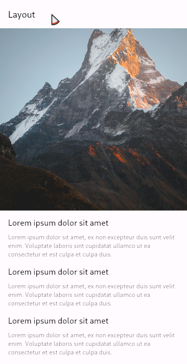
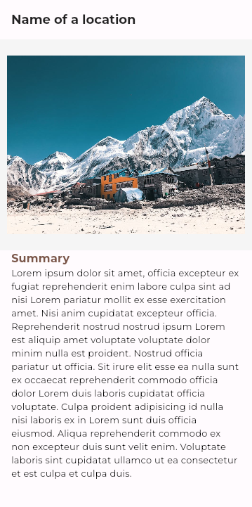

# 30-days-Flutter
## Syllabus & Progress

 - [x] Introduction to Mobile Development
 - [x] History of Moile App Development
 - [x] Dart & Flutter concepts

 - [x] About Dart Language
 - [x] Working with Dart in online & offline mode
 - [x] Dart Basics
 - [x] **Variables, typing disciplines, list(arays), ioops, functions **
 - [x] **Arrow/lambda functions, classes & constructors(its types), objects, map, importing files(reusability)**
 - [x] Dart Installation & working offline
 - [x] Understanding Flutter Framework
 - [x] Setting up Flutter environment
 - [x] **Creating Flutter project** & Understanding the **project structure**
 - [x] Running our **First Flutter App**

 - [x] Exploring Various mobile components & their names

 - [x] Widgets & their types **(Stateful VS Stateless)**

 - [ ] Responsive Design

 - [x] Exploring Widgets in Flutter

 - [x] Exploring various Widgets in Flutter

		- (ListTile, Container Decoration, Card, Buttons, Chips, CircleAvatar, MaterialApp)

 - [x] Understanding the layouts in model & their modelings

		- (Row, Column, Expanded, Gridview, ListBuilder, Stack)

 - [x] Making **Custom Reusable Widgets** in Flutter (through variables,
       functions, classes)

 - [x] Flutter **Filename convention**
 - [x] Creating Multiple screens & **routing** between **Screens**
 - [x] Creating **dynamic routing**
 - [ ] Page **transition** during routing
 - [ ] Playing with **Bottom Navigation Bar**
 - [ ] Understanding the **layouts** in model & their modelings
 - [x] Working with **Image files, & other static files** in Flutter
 - [ ] Exploring **third party & inbuilt libraries**
 - [ ] **REST API** implementation in Flutter (**News App**)
 - [ ] The concept of **Null-Safety** in Flutter
 - [ ] Local database using sqflite
 - [ ] Publishing Flutter app in Google Play

## Snaps

